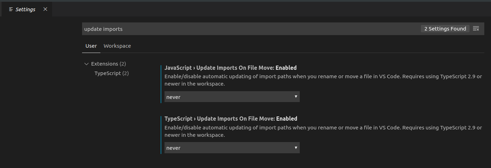
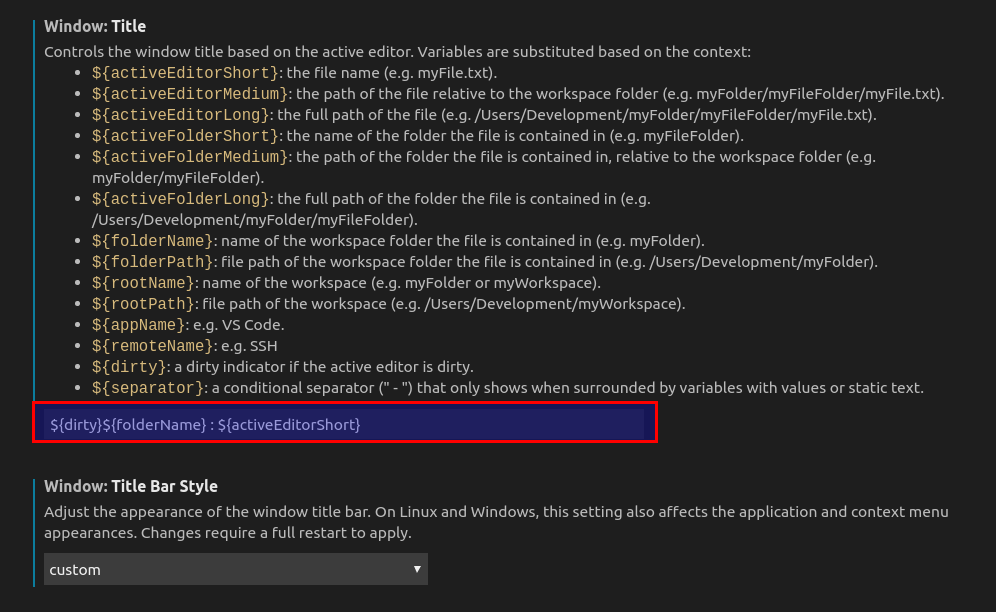
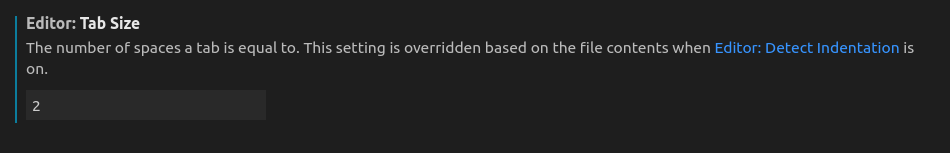

The best way to install Visual Studio Code on Ubuntu is to use Ubuntu Software. If you are not using Ubuntu you can find installtion instructions [here](https://code.visualstudio.com/).

'Ubuntu Software' is a GUI to the repository of software packaged by [Canonical](https://canonical.com/).

- Launch Ubuntu Software
- Type 'visual studio code'
- You will see two results. One for the 'insiders' edition with a green logo. Choose th other one with the blue logo.
- Click install.

When the installation is complete launch VS Code.

## Suggested VS Code Extensions

The full power of VS Code is found in its rich [ecosystem of extensions](https://marketplace.visualstudio.com/vscode). 

If you are following the [Full-Stack MERN Development Series](https://klequis.io/full-stack-mern-development-series/) you will be making use of Prettier. The other extensions are some of my favorites. Click on each link to see what they do.

- [Prettier - Code formatter](https://marketplace.visualstudio.com/items?itemName=esbenp.prettier-vscode)
- [Better Comments](https://marketplace.visualstudio.com/items?itemName=aaron-bond.better-comments)
- [Bracket Pair Colorizer](https://marketplace.visualstudio.com/items?itemName=CoenraadS.bracket-pair-colorizer)
- [npm Intellisense](https://marketplace.visualstudio.com/items?itemName=christian-kohler.npm-intellisense)


## VS Code Settings

You can open VS Code settins from the menu: File > Preferences > Settings

### Update Imports On File Move

Last I tried it, this setting doesn't work well with absolute imports. Absolute imports look like:

```js
import MyComponent from 'src/components/MyCompoent'
```

The equilivent relative import might look like:

```js
import MyComponent from '../../src/components/MyCompoent'
```

Sometimes the `../../ ...` can get 3 or 4 levels and this gets hard to maintain.

With Update Imports On File Move enabled, absolute references get mutated into something very long and it is time consuming to correct them all. To turn this feature off



### Window Title

I didn't find the default window title helpful when I had multiple projects open. Fortunately, VS Code offers great flexibility in how the window title appears. Below is how to change```console my preference.

- Search for 'window title'.
- Set 'Window: Title Bar Style' to 'custom'.
- Click 'Restart' when prompted.

Once restarted, search for 'window title' again and then set it to `${dirty}${folderName} : ${activeEditorShort}`.



## Editor: Tab Size = 2

Tab size is your personal preference if you are working alone or the size dictated by the project you are working on. The code samples in this series all uses 2 spaces. Making this the setting in VS Code will save you time reformatting.


