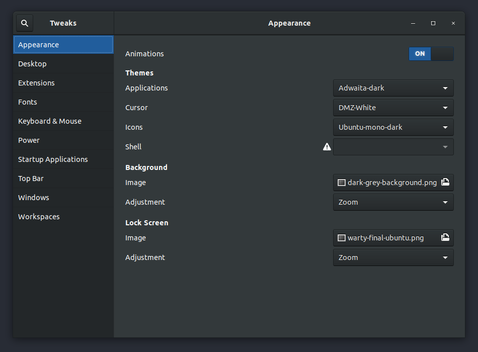

## Super Key

The Super key is the same key as the Windows key on a Windows keyboard. Pressing it brings up the Activities Overview.

## Activities Overview

So you pressed the Super key and and are looking at the Activities Overview. In it you can see the currently open windows and the Workspaces list (see below).

I use the Activities Overview for access to the Search Bar (see below) which I use constantly and the Workspaces List which I use occasionally.

## Search Bar

Speaking of the Search Bar, it is the fastest way of launching applications as well as finding ....   . Just start typing say 'fire'.

The top section of the search results shows Firefox was found as an installed application. The small lighted orange dash at the bottom of the Firefox logo shows that I have one Firefox window open.

The next section is files found that contain 'fire' and the bottom section is software available to install that have 'fire' in their name or description (although I'm not sure how Kdenlive got in there).

## Ubuntu Software

Ubuntu Software is a graphical interface to the GUI to the underlying repositories of software available to install. Not all software you may want to use is available here and sometimes the version of an application in Ubuntu Software is behind what you can get if you go to the applications website and download the application there. I usually compare the version show in Ubuntu Software vs. the website and then decide if the difference, if any, is significant.

To search for an application in Ubuntu Software just start typing. In this image below I typed 'visual studio code'.

If you are not interested in the the details then just use the first one in the list. For those who are curious, let's dig-in a bit using Visual Studio Code as an example.

- Interestingly, I get five matches.
  - 'epipolar-consistency' is there because 'visual studio' is in the description
  - 'Visual Studio Code - insiders' sounds like an early release version with some additional features. But I'm just guessing on that. Right or wrong, I don't want to install that one.
  - There is also this odd one 'Visual Studio Code - OSS' which is a non-propriety version of Visual Studio Code which is not distributed by Microsoft.
  - Visual Studio Code itself is listed twice :(. The second one uses a different installation method called Flatpak.

I'm not very interested in the different installation methods and only have a high level understanding of them. As long as I'm getting the most recent version of an application and everything works well I'm happy. Other people are quite passionate about this subject. If you are interested in learning more check out the links at the bottom of the page.

## GNOME Tweaks

## The Dash

The Dash appears on the left side of the primary monitor. You can add your favorite apps here and launch them, as well as see which apps are running and how many Windows open for each app.

Since I always launch application via the Search Bar, my preference for using the Dash is to remove all 'favorites' so it only shows running applications and the number of windows per application. I can't remember the last time I clicked on it.

To remove apps favorite from the Dash right click on

## Workspaces List

After pressing the Super key you will see on the right side of the screen the Workspaces list. Moving your mouse over the list makes it slide out a bit more.

## Application Menu

## System Menu

## Alt-tab

## Links
- [Linux Package Managers Compared – AppImage vs Snap vs Flatpak](https://www.ostechnix.com/linux-package-managers-compared-appimage-vs-snap-vs-flatpak/)
- [Pros/cons of snap vs apt](https://www.reddit.com/r/Ubuntu/comments/a364ii/proscons_of_snap_vs_apt/)
