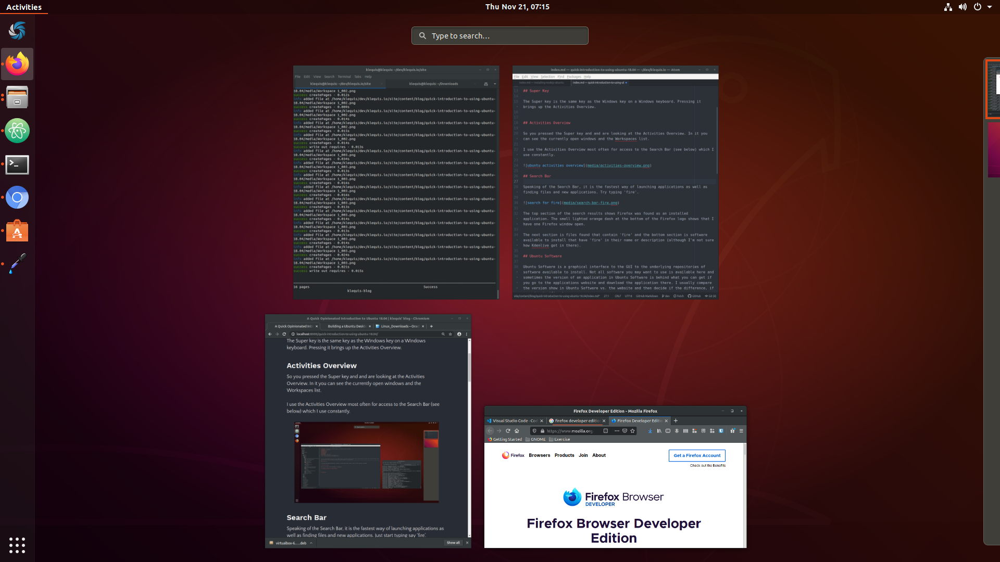

## A Couple of Definitions

**Ubuntu:** is an [open source](https://en.wikipedia.org/wiki/Open_source) [Linux](https://en.wikipedia.org/wiki/Linux) based operating system. Its primary maintainer is [Canonical Ltd](https://canonical.com/).

[**GNOME:**](https://www.gnome.org/) is an [open source](https://en.wikipedia.org/wiki/Open_source) [desktop environment](https://en.wikipedia.org/wiki/Desktop_environment) that is the default for Ubuntu.


## Super Key

The Super key is the same key as the Windows key on a Windows keyboard. Pressing it brings up the Activities Overview.


## Activities Overview

So you pressed the Super key and and are looking at the Activities Overview. In it you can see the currently open windows and the Workspaces list.

I use the Activities Overview most often for access to the Search Bar (see below) which I use constantly.



## Search Bar

Speaking of the Search Bar, it is the fastest way of launching applications as well as finding files and new applications. Try typing 'fire'.


The top section of the search results shows Firefox was found as an installed application. The small lighted orange dash at the bottom of the Firefox logo shows that I have one Firefox window open.

The next section is files found that contain 'fire' and the bottom section is software available to install that have 'fire' in their name or description (although I'm not sure how Kdenlive got in there).

## Ubuntu Software

Ubuntu Software is a graphical interface to the underlying repositories of software available to install. Not all software you may want to use is available here and sometimes the version of an application in Ubuntu Software is behind what you can get if you go to the applications website and download the application there. I usually compare the version shown in Ubuntu Software vs. the website and then decide if the difference, if any, is significant.

To search for an application in Ubuntu Software just start typing. In the image below I typed 'visual studio code'.

If you are not interested in the the details then just use the first one in the list. For those who are curious, let's dig-in a bit using Visual Studio Code as an example.


- Interestingly, I get five matches.
  - 'epipolar-consistency' is there because 'visual studio' is in the description
  - 'Visual Studio Code - insiders' sounds like an early release version with some additional features. But I'm just guessing on that. Right or wrong, I don't want to install that one.
  - 'Visual Studio Code - OSS' which is a non-propriety version of Visual Studio Code which is not distributed by Microsoft.
  - Visual Studio Code itself is listed twice :(. The second one uses a different installation method called Flatpak.

I'm not very interested in the different installation methods and only have a high level understanding of them. As long as I'm getting the most recent version of an application and everything works well I'm happy. Other people are quite passionate about this subject. If you are interested in learning more check out the links at the bottom of the page.

## The Dash

The Dash appears on the left side of the primary monitor. You can add your favorite apps here and launch them, as well as see which apps are running and how many Windows are open for each app.


Since I always launch application via the Search Bar, my preference for using the Dash is to remove all 'favorites' so it only shows running applications and the number of windows per application. I can't remember the last time I clicked on it.

To add an application to Dash search for it then right-click on it and choose Add to Favorites. To remove an application right-click on it in Dash and choose Remove from Favorites.

## Workspaces List

After pressing the Super key you will see on the right side of the screen the Workspaces list. Moving your mouse over the list makes it slide out a bit more.

## Top Bar

The Top Bar runs along to the top of the primary monitor and contains four functional areas.

### Activities

The Activities button is on the left side of the top bar. If you were to click on it the Activities Overview would appear. Pressing Super does the same and is quicker and easier.


### Application Menu

The Application menu is just to the right of the Activities button. It shows a number of application level functions. The functions included on the application menu differ for each application.

**Application menu for Terminal**


**Application menu for Atom**


### Notifications Area

The Notifications area is at the center of the top bar and displays the time and/or date depending on how it has been configured in Settings. Clicking on the Notification area shows the notifications and a calendar.


### System Menu

The System menu is at the far right side of the top bar. I don't use it much except for logging off and restarting. Most of what is in the System menu is easier to get to via the search bar. For example, if you want to power-off your machine just type 'power' and the option to power-off will be presented.


## Alt-tab

Alt-tab is your friend. Use it to switch between windows. One interesting thing is that applications with more than one window open show grouped as you can see below for 'Files'. I have a love-hate relationship with the grouping. On one hand, I often have many windows open and having them grouped makes it visually easier to see what is opened. On the other hand, getting to a window within a group is a bit of gymnastics for my fingers.


## Customization

You can use Ubuntu 18.04 without customization but I have some preferences and Ubuntu allows me to to accommodate them. The two primary ways of customizing GNOME/Ubuntu are Settings and GNOME Tweaks.

### Settings

Settings is a mixture of settings and customizations. I would say turning Bluetooth on or off is a setting, but changing the desktop background is a customization. Settings does both but mostly 'settings'. Pick through the menus to see the possibilities.


### GNOME Tweaks

With GNOME Tweaks you can significantly alter the appearance of GNOME. GNOME Tweaks is not installed by default. You can install it from Ubuntu Software or from the command line.

```console
sudo apt install gnome-tweaks
```


## Links
- [Linux Package Managers Compared – AppImage vs Snap vs Flatpak](https://www.ostechnix.com/linux-package-managers-compared-appimage-vs-snap-vs-flatpak/)
- [Pros/cons of snap vs apt](https://www.reddit.com/r/Ubuntu/comments/a364ii/proscons_of_snap_vs_apt/)
